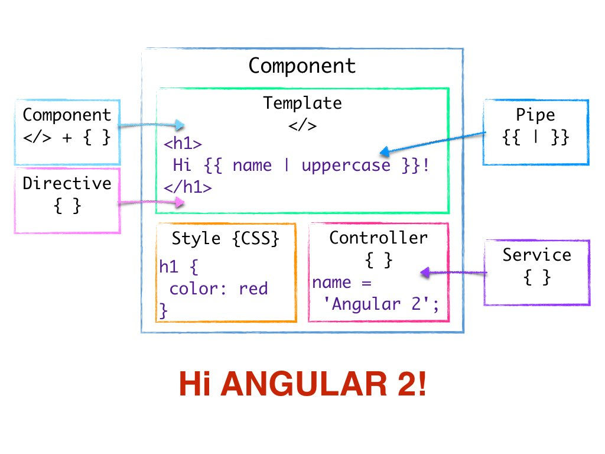

**installare angular**

npm i -v \@angular/cli

**0.0.0.1 - \[LAB\] -[ Using Angular in Gitpod ]**

1.  **Cos'è la Angular CLI**

> Angular è una console che consente di gestire un progetto dandoci già
> una struttura base per far in modo che ogni parte del progetto rimanga
> assenstante a sè e non influisca con il resto del progetto

2.  **Cos'è gitpod?**

> Gitpod è un ambiente di sviluppo online accessibile tramite github,
> accedendo così ad una repository precedentemente creata.

3.  **Come posso vedere l'elenco dei repository remoti?**

> git remote -v

4.  **Qual è il comando per creare una nuova applicazione angular**

> ng new angular-app

## **00.1 - \[TEO\]-\_\_-\_\_\[ [Introduzione ai Componenti]**

## Rispondi alle domande-1°' parte

1.  **Qual è il comando per installare la angular cli?**

> ...\$ npm i -g \@angular/cli

2.  **Cosa contiene la pagina index.html?**

La pagina index.html contiene un codice già generato in precedenza e
app-root

3.  **Cos'è l'app-root?**

> app-root è un componente definito dall'app angular,con funzionalità
> personalizzabile, in questo caso è l'ingresso alla pagina

4.  **Come si avvia un progetto angular?**

> ng serve

### Rispondi alle domande-2°' parte

1.  **Come si crea un nuovo componente?**

> \$ ng generate component nome_componente

2.  **A cosa serve il codice import?**

> **-import serve per dichiarare le dipendenze**

3.  **A cosa serve i decoratore \@Component?**

> i decoratori si possono intendere come metadati aggiunti al codice

a.  **A cosa serve specificare il templateUrl?**

> per definire a quale pagina html riferirsi, per copiarne il contenuto
> e incollarlo ogni volta che viene riferito il tag del componente
> appena creato

b.  **Lo styleUrl?**

> per precisare lo stile del componente, ogni componente è a se stante,
> si scrive come un array \['abc'\] perchè è possibile usare più stili
> per componente

c.  **Il selector?**

> se si vuole creare un tag è importante scriverlo nel selector

4.  **Come si aggiunge un nuovo componente all'app component?**

> va aggiunto il tag del componente nel file html

5.  **Scrivi sul quaderno uno schema che contenga il codice di un
    > componente e di tutti i file a cui fa riferimento**

> \@Component({
>
> selector: \'app-hello-world\',
>
> templateUrl: \'./hello-world.component.html\',
>
> styleUrls: \[\'./hello-world.component.css\'\]
>
> })

6.  **A cosa serve il simbolo {{ }} nel template html**

> richiamare una variabile nell'html

7.  **Da cosa è composta un'applicazione Angular?**

> da componenti personalizzabili richiamati nel file html

8.  **Descrivi le funzionalità riassunte nella seguente immagine
    > (descrivi ogni rettangolo)**

> 
>
> **(puo' aiutare)**
>
> [**[https://ng-girls.gitbook.io/todo-list-tutorial/workshop-todo-list/component]{.ul}**](https://ng-girls.gitbook.io/todo-list-tutorial/workshop-todo-list/component)

 STILE DEL COMPONENTE**(style(CSS))**

HTML DEL COMPONENTE**(Template)**

INDICA CHE E' POSSIBILE INCLUDERE
VARIABILI NEL TEMPLATE**(Component)**

E' POSSIBILE MODIFICARE LA VARIABILE
PASSATA TRAMITE LE { }**(Pipe)**

COMPONENTE**(Component)**

**9) Qual è la convenzione per la nomenclatura dei seguenti file che
costituiscono un componente.**

-   **nome del componente**

-   **nome del template html**

-   **nome del template css**

**(fai un esempio)**

> hello-world.component.ts
>
> hello-world.component.html
>
> hello-world.component.css

## **01.1 - \[TEO\] -[ Using Data ]**

1.  **Come si dichiara una proprietà di una classe (variabile visibile a tutta la classe) in Angular?**

> prop_name : prop_type;
>
> name: string;

2.  **Come si dichiara un costruttore?**

> constructor() {
>
> this.name = \'Felipe\';*// inseriamo il nome nel costruttore*
>
> }

3.  **Cos'è un costruttore?**

> è una funzione che definisce la variabile nel momento in cui viene
> chiamato

4.  **Secondo te, quando viene creata l'istanza di una classe Angular?**

> ogni volta che viene richiesta in una pagina html

5.  **Come si aggiunge una proprietà (o variabile) al template HTML?**

> {{nome_variabile}}
